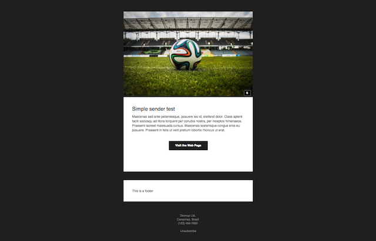

ts-framework-notification
=========================

[](https://gitlab.devnup.com/npm/ts-framework-notification/commits/master)
[](https://gitlab.devnup.com/npm/ts-framework-notification/commits/master)

A minimalistic framework for typescript based applications, with async/await and decorators support.

This plugin extends the Server for handling transactional notifications through multiple transports. 


```bash
# Install using yarn
yarn add git+https://gitlab.devnup.com/npm/ts-framework-notification.git#master

# Install using NPM
npm install --save git+https://gitlab.devnup.com/npm/ts-framework-notification.git#master
```

## Getting Started

The Notification module comes with built-in support for the following transports:

- **E-mail (SMTP):** Backed by `nodemailer` and `email-templates` modules.
- **Firebase Cloud Messaging:** Using the official `firebase-admin` module.

### Email transport

Sending a simple `html` or `plain text` message:

```typescript
import { Email } from 'ts-framework-notification';

const email = new Email({
  from: process.env.SMTP_FROM,
  connectionUrl: process.env.SMTP_URL
});

// Send a simple E-mail message
const response = await email.send({
  to: 'hello@company.com',
  subject: 'Welcome aboard!',
  text: 'Thank you for creating a new account! https://google.com',
  html: 'Thank you for creating a new account! <a href="https://google.com>Click here to login</a>'
});

console.log(response);
```

Sending a simple email message using the default template. 

```typescript
import { Email } from 'ts-framework-notification';

const email = new Email({
  from: process.env.SMTP_FROM,
  connectionUrl: process.env.SMTP_URL,
  template: {
    enabled: true
  }
});

// Send an E-mail using the default template (Cerberus)
const response = await email.send({
  to: 'hello@company.com',
  subject: 'Welcome aboard!',
  locals: {
    title: 'Simple sender test',
    logo: 'https://i.imgur.com/5UMVOBG.jpg',
    body: 'Thank you for creating a new account!'
    button: {
      label: 'Visit your Accoutn',
      url: 'https://company.com/account'
    },
    footer: 'This is a footer',
  },
});

console.log(response);
```

Special thanks to the [Cerberus](http://tedgoas.github.io/Cerberus) team, that developed a great e-mail template, used here as the default template.

<center></center>

<p><br /></p>

### Firebase transport

Sending a simple push notification for Android and iOS:

```typescript
import { Firebase } from 'ts-framework-notification';

const firebase = new Firebase({
  serviceAccount: require('../service_account.json'), // The service account from Firebase console
  databaseURL: 'https://<APP_NAME>.firebase.io'
});

// Send a simple notification
const response = await firebase.send({
  registrationToken: '< THE REGISTRATION TOKEN FOR THE SPECIFIC DEVICE OR ARRAY OF TOKENS >',
  title: 'Hello World!',
  body: 'This is a simple notification message.',
  sound: '< the sound name >',
  color: '< the color hex >', // Android only
  badge: '< the count for the badge >', // iOS only
  // More options in the TS typings...
});

console.log(response);
```

## Documentation

See the [Full documentation](./docs/index.md) in the repository.

## Roadmap

- Push notifications (Firebase for iOS, Android and Web)
  - [OK] Firebase simple notifications for iOS and Android
  - Firebase Data notifications for iOS and Android
  - Firebase Web notifications
  - APNS native integration
- SMS notifications (Twilio)

## License

The project is licensed under the [MIT License](./LICENSE.md).